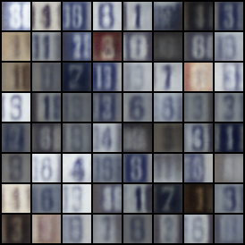

# DisRegGen

This is a pytorch implementation of the paper [Discriminative Regularization for Generative Models](https://arxiv.org/pdf/1602.03220.pdf) by Alex Lamb, Vincent Dumoulin and Aaron Courville.

## Reference Papers
- [Discriminative Regularization for Generative Models](https://arxiv.org/pdf/1602.03220.pdf)
- [Auto-Encoding Variational Bayes](https://arxiv.org/pdf/1312.6114.pdf)
- [Unsupervised  representation  learning  with  deep  convolutional  generative  adversarial  networks](https://arxiv.org/pdf/1511.06434.pdf)
- [Very deep convolutional  networks  for  large-scale  image  recognition](https://arxiv.org/pdf/1409.1556.pdf)
- [Perceptual Losses for Real-Time Style Transfer and Super-Resolution](https://cs.stanford.edu/people/jcjohns/papers/eccv16/JohnsonECCV16.pdf)

## Results

Original                  |  VAE                   | DisRegGen             |
:-------------------------:|:-------------------------: |:-------------------------:
  |   | 
  |   | 

## License

This project is licensed under the MIT License - see the [LICENSE.md](https://github.com/Alfo5123/DisRecGen/blob/master/LICENSE) file for details.
